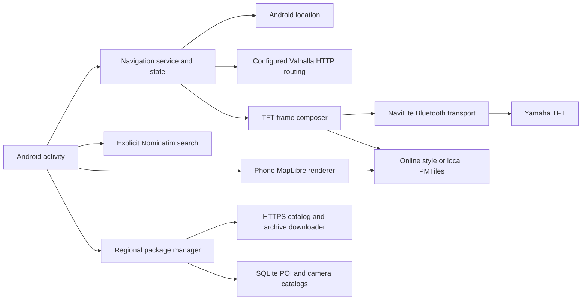

# Architecture

NavFrame separates navigation state, Android services, rendering, local map data, and the experimental Yamaha display protocol.

## Modules

- `app` contains the Android activity, foreground navigation service, location and voice controllers, phone/TFT renderers, online routing/geocoding adapters, offline map/package managers, and user interface.
- `core` contains platform-independent route, map-frame, guidance, camera-alert, and regional-package models and parsers.
- `navilite` contains the adapted Yamaha TFT protocol and transport support. It includes code adapted from Pillion and is subject to the noncommercial terms documented in [Licensing](LICENSING.md).

## Main flows

The activity owns map exploration and explicit search/route actions. GPS guidance moves into a foreground service so it can continue when the activity is not visible. The service combines location fixes with a previously calculated route, creates navigation state, and composes a 480×240 frame. The frame is rendered locally and, when connected, sent through NaviLite over Bluetooth. Demo mode uses synthetic data and must remain visibly identified as demo.

Routing sends an explicit origin/destination request to the configured HTTPS Valhalla-compatible endpoint. Address search sends text only after the user requests an online search. Neither public service is an availability commitment. Previously calculated route geometry may be followed without a fresh routing request, but offline route calculation and recalculation are not implemented.

Offline map packages contain `manifest.json`, `map.pmtiles`, and `pois.sqlite`. The manifest records schema, geographic bounds and polygon coverage, source provenance, attribution, and component checksums. On import or download, the package is staged, checked, and committed to private app storage only after validation. POI and optional camera records are queried from local SQLite databases. Regional maps are selectable individually; seamless rendering of multiple adjacent regional maps is not yet provided.

Worldwide region discovery/building is a separate publishing pipeline. Geofabrik extracts are transformed into NavFrame packages and distributed as GitHub Release assets; the Android app fetches a catalog and verifies the selected package before installing it. The workflow builds regions on demand, so discovery does not imply that every region is published or suitable for every device. See [GLOBAL_OFFLINE.md](GLOBAL_OFFLINE.md).

## Trust and limitations

The regional catalog URL is configurable. HTTPS protects transport to the selected host; archive SHA-256 values detect mismatch with that catalog. The app does not currently pin a signing key for catalog authenticity. Only install catalogs from a source you trust.

OpenStreetMap-derived content can be incomplete or stale. Camera alerts are optional, jurisdiction-sensitive, and cannot establish enforcement direction or absence. Android TextToSpeech availability and offline voice data depend on the selected engine and installed voice. The current directions voice is Spanish. Detailed physical validation status is recorded in [TESTING.md](TESTING.md).
